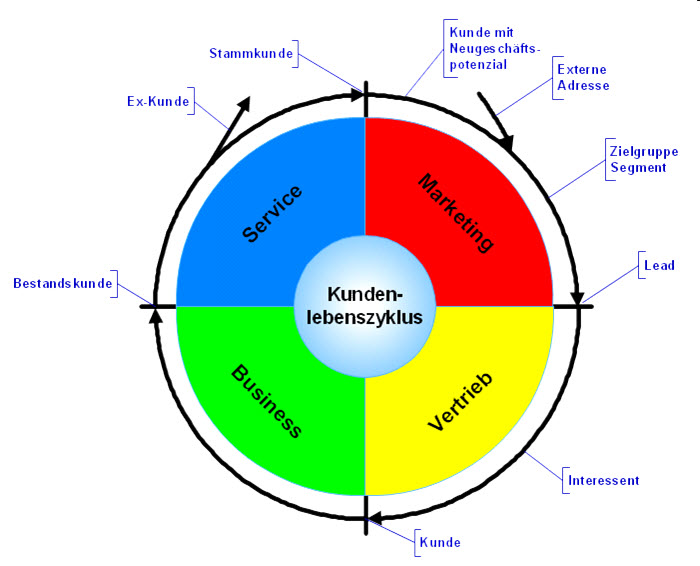
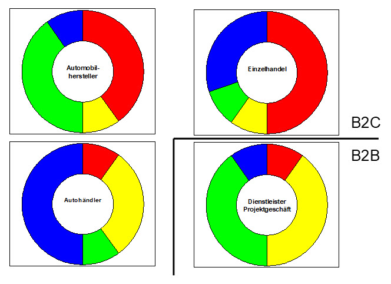

# Der Kundenlebenszyklus (KLZ)

In der [DSAG](https://dsag.de/) wurde ca. 2008 im Arbeitskreis "Vertrieb und Marketing" eine Darstellung des "Kundenlebenszyklus" entwickelt, die so oder so ähnlich bis heute des Öfteren eingesetzt werden konnte. 

In der klassischen Kundensicht "entsteht" ein Kunde durch einen Auftrag und wird uninteressant, wenn die letzte Rechnung bezahlt ist und keine Beschwerden oder andere Serviceaktivitäten mehr "gemacht werden müssen".  

In einer kundenorientierten Sicht gibt es natürlich ein Leben vor dem Auftrag und es wird versucht, den Kunden an sich zu binden, um ihn dann als Stammkunden erneut in den Kreislauf zu bekommen.

Schreibt man jetzt noch die betriebswirtschaftlichen Vorgänge wie "Lead", "Verkaufschance", "Angebot", "Auftrag", "Lieferschein", "Rechnung", "Servicevetrag", u.a. an die jeweiligen Stellen des Kreises, dann werden die betriebswirtschaftlichen Zusammenhänge noch klarer.

Eine weitere Möglichkeit ist es, die Relevanz der farbig markierten Hauptphasen aufgrund von tatsächlichen Durchlaufzeiten, Anzahl beteiligter Prozesse bzw. Systeme oder sonstigem Aufwand zu bewerten und dies über die Größe der vier Bereiche darzustellen. Damit können dann recht schnell Unterschiede zwischen Organisationen visualisiert werden.

Eine "rot-dominante Organisation" ist dann beispielsweise Marketing-getrieben und wird hier entsprechende Werkzeuge einsetzen.  

Aus Sicht der Digitalisierung kann für die einzelnen Phasen zusätzlich überlegt werden, wie man die Informationen zum Kunden ergänzen bzw. die "Erfahrung" des Kunden in dieser Phase verbessern kann. Hier spielen Technologien wie Datenanalyse, mobile oder Internet-Anwendungen, Künstliche Intelligenz, u.ä. vielleicht eine Rolle. Aus heutiger Sicht sollten auch die eigenen Produkte untersucht werden, ob man sie "smarter" machen kann. 