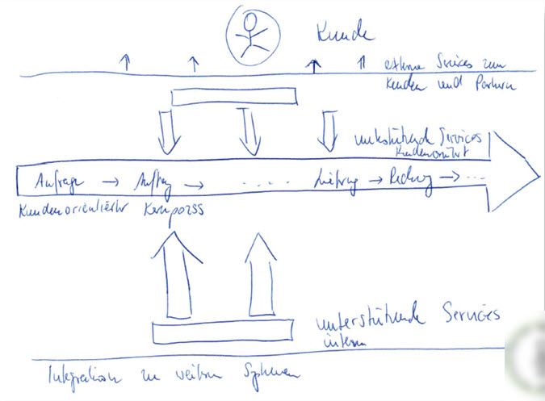

# Wie sortiert man Komplexität?

Die Welt ist komplexer und schneller geworden. Gerade wenn man in ein Digitalisierungsvorhaben startet, muss man sich mit der vorhandenen Komplexität auseinandersetzen.
Für Projekte - gerade wenn sie sehr lange dauern - ist es immer sehr hilfreich, wenn man eine grafische Darstellung entwickelt, die über einen längeren Zeitraum stabil bleibt, in der sich alle Beteiligten wiederfinden und die Orientierung gibt.

Aber wie macht man das? Wie schafft man es, die vorhandene Komplexität, den unterschiedlich ausgeprägten Geltungsanspruch der Beteiligten und das eigentliche Ziel unter einen Hut zu bringen?

## Orientierung am Kunden

Wenn wir in der heutigen Zeit über Digitalisierung reden und es ernsthaft betreiben wollen, dann steht der Kunde im Mittelpunkt und mit welchem Geschäftsmodell oder welchen Produkten wir zukünftig mit ihm eine - für beide Seiten erfolgreiche - Beziehung eingehen wollen. 

Ist es da nicht naheliegend, sich am Kunden zu orientieren? Also: wie nimmt der Kunde aus seiner Sicht das eigene Unternehmen wahr und in welchen Schritten durchläuft er verschiedene Phasen und Abteilungen? 

### Kundenorientierter Kernprozess (KKP)

Als erstes stellt man den Kunden mit seinem "kundenorientierten Kernprozess" (KKP) in den Mittelpunkt. Beispielsweise als "roter Faden" bzw. Zeitstrahl von links nach rechts.

Auf diesem Zeitstrahl finden sich dann solche Dinge wie:
- Marketing
- Anfrage
- Angebot
- Auftrag
- Produktion
- Versand
- Rechungslegung
- Reklamationsbearbeitung
- Zahlungseingang
- Mahnwesen

### Unterstützende Prozesse

Je nach Phase auf dem Zeitstrahl werden "Unterstützende Prozesse", Werkzeuge u.ä. platziert, die für den Kunden und seine Interessen unbedingt erforderlich sind:
- Einkauf
- Produktionsplanung
- Qualitätsmanagement
- Transportmanagement
- Stammdatenmanagement
- Exportkontrolle/Außenhandel/Compliance
- Lagermanagement
- ... 

### Administrative Prozesse

Es folgen dann (in der "3. Reihe") Dinge, die aus Sicht des Kunden nicht unbedingt erforderlich sind bzw. seine Interessen nicht "aufhalten":
- Finanzen
- Controlling
- Investitionsmanagement
- Energiemanagement
- Umweltmanagement
- Personalmanagement
- ...

### Infrastrukturprozesse

Zum Schluss (4. Reihe) werden dann noch Infrastrukturprozesse ergänzt:
- Instandhaltungsmanagement
- IT Management

## Ein Beispiel

Die folgende Skizze ist in einem größeren Projekt entstanden, wo am Anfang etwas Ordnung in die ca. 400 Einzelprozesse gebracht werden musste. 

Dieser erste Entwurf entstand nach Dienst im Restaurant und wurde dann später noch etwas verfeinert und beispielsweise als Poster im Projektraum aufgehängt. Man sieht dort schon die Grundstruktur, der dann später die ca. 400 Einzelprozesse zugeordnet wurden. 

Auf dieser Basis entstanden dann eindeutige Bezeichnungen für die Prozesse und einheitliche Ordnerstukturen/-vorgaben, welche die Orientierung der Beteiligten in der komplexen Realität deutlich vereinfachte.

## Anwendungsgebiete

Diese Art der Darstellung erleichterte die Diskussionen im Projekt, da man immer zeigen konnte, wo man sich gerade befindet. 

Eine weitere Empfehlung ist, dass man diese Darstellung für integrative Schulungen, Tests u.ä. verwendet und immer aus Sicht des Kunden die Prozesse zeigt. Das führt zwar dazu, dass beispielsweise verschiedene Abteilungen abwechselnd etwas zeigen müssen. Es fördert allerdings das gegenseitige Verständnis und deckt die ein oder andere Schwäche im Prozess auf - jeder Wechsel der Verantwortlichkeit ist aus Sicht des Kunden meistens eine Verzögerung. 

Rollenspiele und Einzelpersonen die Rolle als "unangenehme Sonderkunden" zu geben, fördert das Verständnis für die Realität und Außenwahrnehmung ... 

## Achtung: Konfliktpotenzial!

Diese Vorgehensweise hat selbst in einem sehr komplexen Großprojekt gut funktioniert. Aber es birgt Konfliktpotenzial. Vor allem weil die häufig mächtigen Unternehmensabteilungen Finanzen, Controlling u.ä. mit dieser Sichtweise "degradiert" werden. Das gefällt nicht jedem. Aus Sicht des Kunden ist es aber vernachlässigbar, wenn ein Bericht mal ein paar Tage nicht geht oder die Rechnungen verzögert erstellt werden. 

Sich konsequent am Kunden auszurichten erfordert Kompromissbereitschaft und ggf. auch Opfer. Das macht genau diese digitale Transformation aus und erklärt, warum wir uns damit so schwer tun. 
