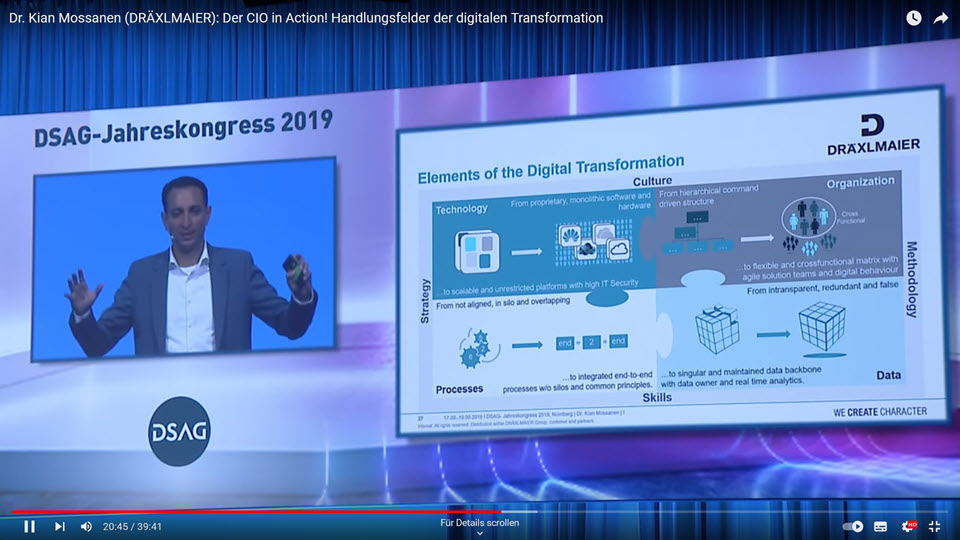
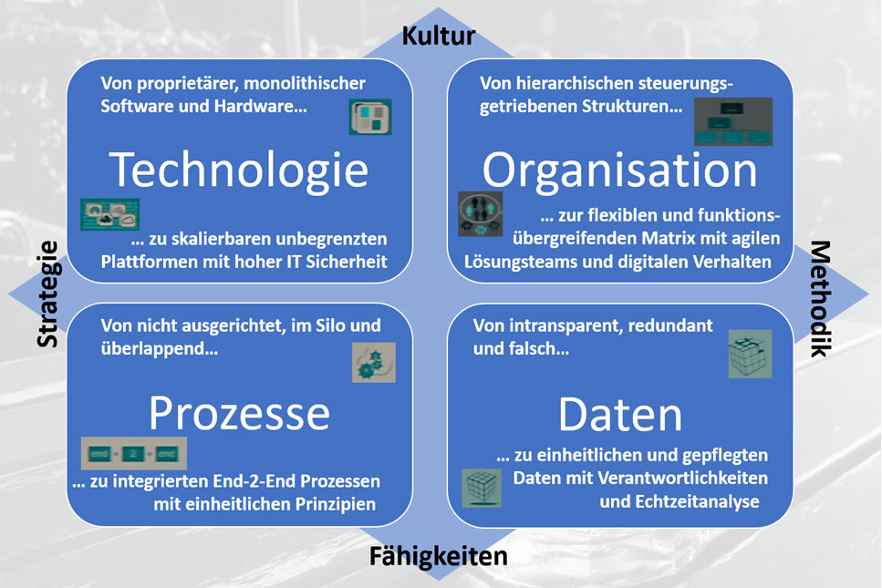

# Handlungsfelder der Digitalisierung

Ein empfehlenswerter Vortrag zum Thema Digitalisierung stammt vom Jahreskongress der Deutschsprachigen SAP Anwendergruppe e.V. ([DSAG](https://dsag.de/)). 

Dr. Kian Mossanen von DRÄXLMAIER hielt dort die Keynote "Der CIO in Action! Handlungsfelder der digitalen Transformation", die als [Youtube Video](https://youtu.be/kSfrayKqWRY) öffentlich zugänglich ist.

  

Ab Minute 20 geht er für ca. 5 Minuten auf die hier thematisierten "Handlungsfelder der Digitalisierung" ein. 5 Minuten, die zu empfehlen sind.  

## Deutsche Version 

Für den SAP Stammtisch haben wir uns aus diesem Vortrag bedient und die dort präsentierte Folie eingedeutscht. Das war leider notwendig, weil der Foliensatz der DSAG Keynote im Nachgang zwar verfügbar war, aber diese interessante (englische) Folie leider fehlte. 

## Kommentar

Was ist auf dieser Folie zu sehen? 

Wenn sonst über Digitalisierung gesprochen wird, wird häufig nur die technische Infrastruktur thematisiert: "wenn wir erst einmal Glasfaser und neue Technik haben, dann sind wir damit durch...".

So etwas findet sich auf dieser Folie gar nicht. Der Bereich "Technologie" ist zwar enthalten, meint aber etwas völlig anderes: "skalierbar, sicher und weg vom alten Denken". Dafür finden sich weitere Schlagworte auf dieser Folie: "Strategie, Kultur, Fähigkeiten, Methodik" und weitere Bereiche wie "Organisation, Daten und Prozesse". Und zwar nicht so, wie wir die Dinge heute verstehen, sondern so, wie wir es zukünftig brauchen werden. 

Glaubt man dieser Folie bzw. hält man sie für "richtig", dann rollt einiges an Herausforderungen und Veränderungen auf uns zu. Und diese Veränderungen betreffen nicht nur Technologie und Infrastruktur, sondern vor allem uns Menschen. Wie wir denken und zusammen arbeiten. Welche Fähigkeiten wir zukünftig brauchen. Wie wir mit unseren Daten umgehen (sollten). 

Anregungen und relevante Handlungsfelder liefert diese Folie bzw. die Keynote.

