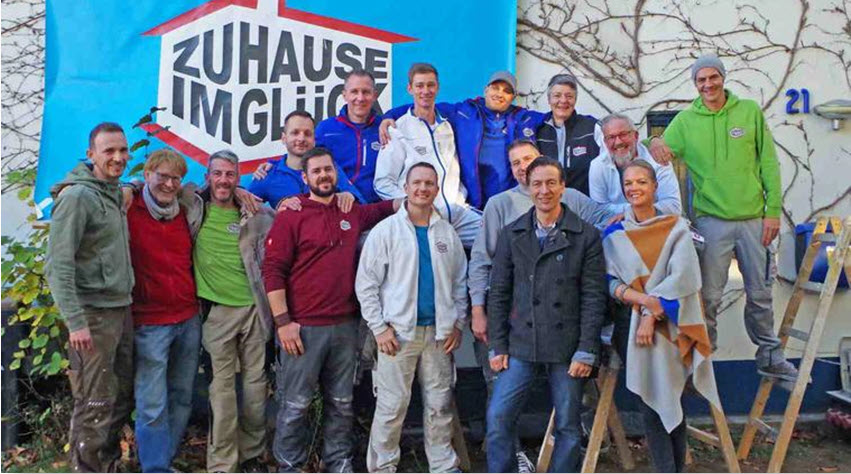

# Wie sieht ein ideales Team  aus?

Man hört oft, dass man für die Digitalisierung ein schlagfertiges interdisziplinäres Team benötigt, welches zusammen durch dick und dünn geht, sich gegenseitig vertraut und mit einer agilen Vorgehensweise alle Herausforderungen der Realität schon irgendwie meistert... 

In den [Handlungsfeldern der Digitalisierung](5_handlungsfelder.md) steht im Bereich Organisation *"Von hierarchisch steuerungsgetriebenen Strukturen ... zur flexiblen und funktionsübergreifenden Matrix mit agilen Lösungsteams und digitalen Verhalten"* was mit Veränderungen der Kultur und Methodik einhergeht.

Ziemlich viele Beraterfloskeln? Wie sieht so etwas in der Praxis aus?

## Ein Praxisbeispiel

Ein gutes Beispiel für ein solches Team ist die Doku Soap ["Zuhause im Glück - Unser Einzug in ein neues Leben"](https://de.wikipedia.org/wiki/Zuhause_im_Gl%C3%BCck_%E2%80%93_Unser_Einzug_in_ein_neues_Leben), die zwischen 2005 und 2019 produziert und bei RTL2 ausgestrahlt wurde.

*"In der Fernsehsendung wurde gezeigt, wie Innenarchitektin Eva Brenner und Architekt John Kosmalla sowie zwölf weitere Handwerker pro Sendung mehrere Zimmer im Haus einer in einer Notsituation befindlichen Familie innerhalb von acht Tagen umbauen. Die Familie war in dieser Zeit in einem nahegelegenen Hotel untergebracht und durfte keinen Kontakt zu der Baustelle haben. Generell wurde auf die Bedürfnisse und Wünsche der jeweiligen Familien eingegangen, damit am Ende sowohl für Familie als auch für das Team ein zufriedenstellendes Ergebnis vorhanden war. Es wurden, im Gegensatz zu anderen Einrichtungssendungen im privaten Fernsehen, nicht nur Trockenbauwände errichtet, sondern auch Dachfenster eingesetzt, außergewöhnlich viele Durchbrüche gemacht sowie das Konzept der jeweiligen Wohnung grundlegend geändert. In Containern und Wohnmobilen verfügte das Bauteam direkt an der Baustelle über eine eigene Küche und konnte dadurch flexibel und rund um die Uhr arbeiten."*

## Agilität

Diese Serie "Zuhause im Glück" ist ein schönes Beispiel für den Begriff der Agilität:
- Es gibt ein Deadline, wo die Bewohner des Hauses wieder einziehen wollen. Dieser Termin ist nicht verhandelbar
- Es gibt ein ungefähres Budget, in dessen Rahmen sich das Team bewegen darf und das sicherlich auch mal nach oben angepasst wurde
- Es gibt ein gemeinsames Ziel
- Es gibt am Anfang einen Plan, der oft durch die Realität durchkreuzt wurde
- Rollen und Verantwortlichkeiten sind verteilt
- Architekt, Bauleiter sowie die bunt zusammen gemischte "Mannschaft" harmonieren
- Kurzfristige Störungen werden zeitnah behoben oder es wird improvisiert 
- Das Team macht menschliche Fehler, trifft falsche Annahmen und muss auf das ein oder andere Missgeschick kurzfristig reagieren
- Die "Gewerke" helfen sich gegenseitig

## Kommentar

Jetzt mal ehrlich: wer kann von sich behaupten, dass im eigenen Unternehmen bzw. Organisation eine solche Projektkultur existiert? Dass die unterschiedlichen Abteilungen, Charaktere und Hierachieebenen vertrauensvoll, zielorientiert und kompromissbereit zusammen arbeiten? Dass nicht über Kleinigkeiten in großen Runden unnötig lange diskutiert wird und am Ende häufig nicht mal eine zielführende Entscheidung (für den Kunden oder das ausgegebene Ziel) heraus kommt? Keine "Ober-schlägt-Unter-Spielchen", kein "Ich will ..."?

Das ist dieser "Kulturelle Wandel", den wir brauchen, um die Komplexität, die Krisen und sonstige Herausforderungen in den Griff zu bekommen. Dieses "Menschen mitnehmen" und auf gemeinsame Ziele einschwören ist die eigentliche Herausforderung der Digitalisierung. Technologie ist nur ein Werkzeug.