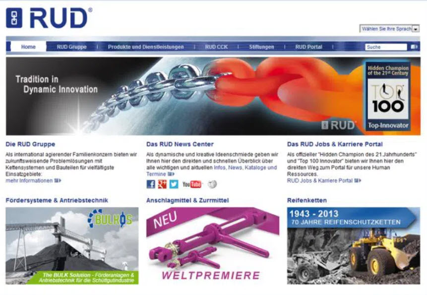
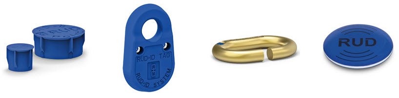

# In den Kunden investieren - Beispiel RUD

Dieses Beispiel kommt von dem Unternehmen [RUD](https://www.rud.com). RUD stellt unter anderem viele unterschiedliche Arten von "Ketten" her - z.B. Spannketten für den Transport, Schneeketten usw. Sie wurden bereits mehrfach als besonders innovativ ausgezeichnet. 2013 errangen sie beispielsweise Platz 1 bei der Suche nach den ["Best in Cloud" Projekten der Computerwoche/CIO](https://www.cio.de/a/die-besten-cloud-projekte-2013,2938689). Informationen zur prämierten Lösung und ein Video findet man [hier](https://www.computerwoche.de/a/pruefservice-rud-id-net-schafft-mehrwert-fuer-rud-ketten,2545719). 

Bei der prämierten Lösung "RUD-ID-NET" handelt es sich um ein Cloud-basiertes Prüfmanagement-System. RUD unterstützt damit vor allem die gesetzlich vorgeschriebenen regelmäßigen Überprüfungen von prüfpflichtigen Produkten. Mit dem Service können die Kunden ihre prüfpflichtigen Produkte eindeutig identifizieren und vergessen keine Prüftermine mehr. 

## Hintergrundinformationen

RUD hat sehr früh angefangen, über die [RFID Technologie](https://de.wikipedia.org/wiki/RFID) die eigenen Produkte identifizierbar zu machen. D.h. in und an den Produkten wurden RFID Chips oder Anhänger angebracht (siehe Bild).

Das half der eigenen Produktion und Logistik, weil jedes Produkt eindeutig identifizierbar war und bereits auf dem RUD Werksgelände eine eigene "Historie" erhielt.

Dann merkte man, dass es durchaus "interessant" wäre, wenn der Kunde diese Technologie ebenfalls für sich nutzen könnte. Man nahm entsprechende Lesegeräte in verschiedenen Ausführungen in die [Produktpalette](https://www.rud.com/produkte/anschlagmittel-zurrmittel/rud-id-system.html) auf.

Parallel entstand ein Kundenportal, in dem die Kunden ihre RUD Produkte registrieren konnten und als Gegenleistung beispielsweise automatische Benachrichtigungen über anstehende Fristen bekamen. Es begann eine Erfolgsgeschichte. Dieses Kundenportal wurde aufgrund des Erfolgs mehrfach mit neuen Funktionen erweitert und 2013 dann schließlich als "Best in Cloud" prämiert.

Heute bietet RUD sogar eine [eigene App für Android und iOS](https://www.rud.com/produkte/anschlagmittel-zurrmittel/rud-id-system/rfid-applikation.html) an, welche die RFID Fähigkeiten der RUD Produkte und Funktionen des Cloud Portals auch mit mobilen Geräten nutzbar macht. 

## Kommentar

Zitat aus dem [Computerwoche Beitrag](https://www.computerwoche.de/a/pruefservice-rud-id-net-schafft-mehrwert-fuer-rud-ketten,2545719) zur Lösung:  
*"Es wurde zunächst als Speziallösung für die prüfrelevanten Produkte von RUD Ketten konzipiert. Aufgrund des großen Interesses der RUD Kunden bauten die Entwickler das System während der Projektphase zu einem produktunabhängigen, weltweit für alle prüfrelevanten Bauteile einsetzbaren Prüfmanagement-System aus."*.

Bereits in einer Phase, als der spätere Erfolg noch nicht absehbar war, wurde in den Kunden investiert und bewusst Mehrwerte für ihn geschaffen. Der Nutzen für RUD besteht in einer hohen Kundenzufriedenheit und Kundenbindung. Wenn die RUD Kunden ihre Daten in die Portallösung erst einmal eingegeben haben, wechseln sie so schnell nicht mehr. Dafür war RUD bereit, die Lösung auch für Mitbewerber und fremde Produkte zu öffnen.

Das ist das, was Kosten von Investitionen unterscheidet. Man hofft zwar auf den Erfolg einer Maßnahme und dass es sich "irgendwann" einmal auf den Unternehmenserfolg positiv auswirkt. Planen, messen oder erzwingen kann man es allerdings nicht. 

Typische Fragen wie "Was haben wir davon?", "Lohnt sich das für uns?", "Wann haben wir die Kosten wieder eingespielt?", "Wie können wir sicherstellen, dass...?", "Mit welchen Kennzahlen können wir das messen?" zerstören solche Ideen. 

Fehlschläge müssen einkalkuliert werden und wenn jedes Mal die mutigen "Verursacher" mit Konsequenzen bestraft werden, bleibt am Ende nur eine Gruppe von risikoscheuen Bedenkenträgern, mit denen keine Zukunft zu machen ist... 
