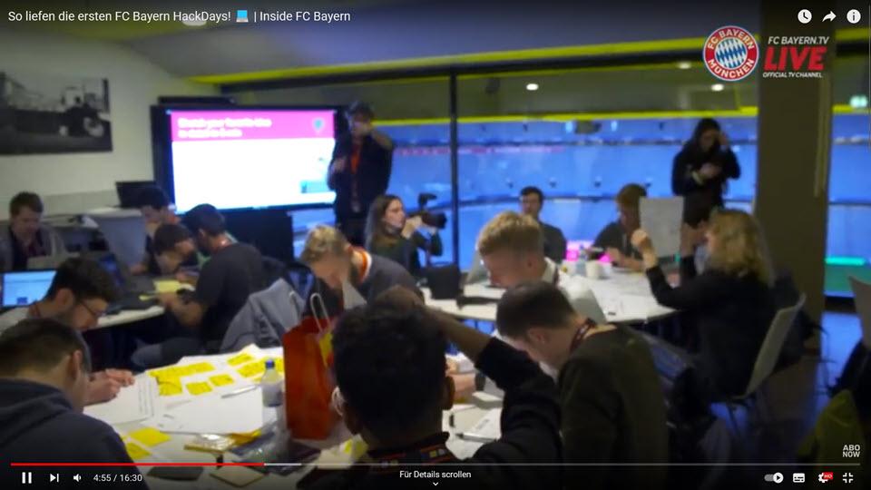

# Der FC Bayern Hackathon

Der FC Bayern hat im Jahr 2018 einen erfolgreichen Hackathon veranstaltet. An einem langen Wochenende wurden durch internationale Teilnehmer zukünftige technische (Fan-)Lösungen entworfen, die teilweise sogar sofort einsatzfähig waren. 

Einen guten Eindruck, was man sich darunter vorstellen kann, liefert [dieses Video](https://youtu.be/5DP8TWOjVHQ).

## Was ist ein Hackathon?

Auf [Wikipedia](https://de.wikipedia.org/wiki/Hackathon) findet man dazu die folgende Definition:

*"Ein Hackathon (Wortschöpfung aus „Hack“ und „Marathon“) ist eine kollaborative Soft- und Hardwareentwicklungs­veranstaltung...Ziel eines Hackathons ist es, innerhalb der Dauer dieser Veranstaltung gemeinsam nützliche, kreative oder unterhaltsame Softwareprodukte herzustellen oder, allgemeiner, Lösungen für gegebene Probleme zu finden. Die Teilnehmer kommen bei Software-Hackathons üblicherweise aus verschiedenen Gebieten der Software- oder Hardwareindustrie und bearbeiten ihre Projekte häufig in funktionsübergreifenden Teams. Hackathons haben immer ein spezifisches Thema oder sind technologiebezogen."*  

## Kommentar

Man kann vom FC Bayern halten was man will. Mit diesem Event haben sie Neuland betreten und gezeigt, dass ein Hackathon mit Fans funktionieren kann. Natürlich hätte der FC Bayern auch externe Beratungsfirmen engagieren können, die dann für die Fans Softwarelösungen bauen. Das hätte auf jeden Fall mehr Zeit und Geld gekostet. Man hätte vor allem vorher Konzepte machen müssen, was hinten heraus kommen soll. Was der Fan sich wünscht, weiss der Kunde Fan doch am besten? 

Man kann den Begriff Hackathon durchaus etwas weiter fassen und nicht nur auf Software- oder Hardwareentwicklung eingrenzen. Hackathons in Unternehmen bzw. Organisationen können so organisiert sein, dass die Technologie "zum Anfassen" bereit steht und dann in der Gruppe nach Einsatzszenarien gesucht wird - also gemeinsam eine praxisnahe Anwendung gefunden wird.

Durch interdisziplinäre (also abteilungsübergreifende) Teams werden in einem vorgegebenen Zeitraum ein oder mehrere gemeinsame Ziele verfolgt und am Ende auch vor der großen Gruppe präsentiert. Softwareentwickler oder Technologieexperten stehen dann "nur" zur Unterstützung oder für Fragen zur Verfügung. Das Team organisiert sich selbst und darf sich auch mal verrennen.

Selbst wenn es für die beteiligte Technologie keine nützliche Anwendung geben sollte: alle Beteiligten wissen danach (hoffentlich), wie die Technologie funktioniert und vielleicht kommt irgendwann einmal der Zeitpunkt, an dem die Zeit reif ist...  
